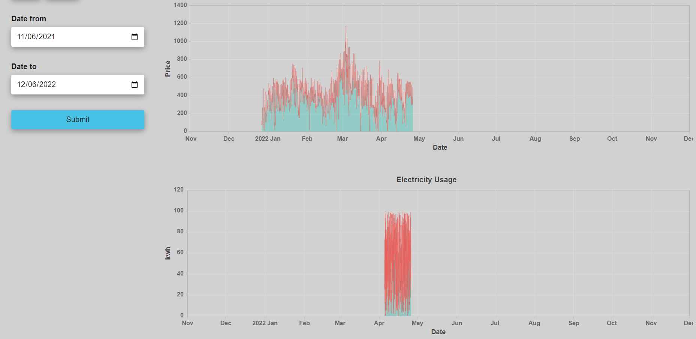

# Welcome to Power UP

```sh
# start the remix dev server
npm run dev
```

Open up [http://127.0.0.1:3000](http://127.0.0.1:3000) and you should be ready to go!

## Deployment

Deployed on Netlify trough GitHub integration:

[https://sweet-crostata-08df53.netlify.app/](https://sweet-crostata-08df53.netlify.app/)

## Features

- [ ] Authentication
- [ ] Choose between metering points
  - [ ] Preview electricity price chart for date period range
  - [ ] Preview electricity usage chart for date period range

> **Note**
> Records were read only for the time period shown below in the picture


